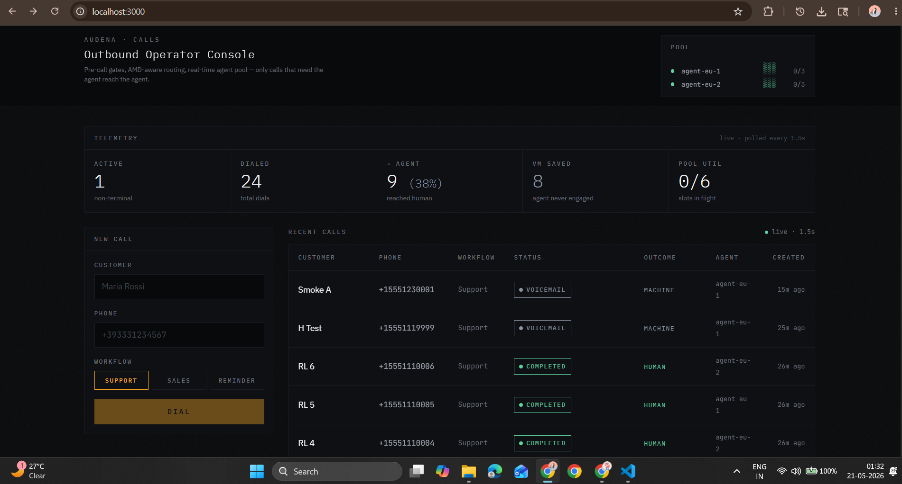

# Audena Calls — Full-Stack Homework

A small web app that lets a user trigger automated voice calls, hands them off
to a simulated telephony provider (Twilio- or Telnyx-shape, selectable via
`CALL_PROVIDER`), and shows status updates streamed back over a webhook.

Built for the Audena Full-Stack Developer (Product + Integrations) homework.



---

## Run it

Requirements: Node.js 18+ and npm.

```bash
git clone <this repo>
cd audena-calls
cp .env.example .env
npm install        # installs deps; generates Prisma client via postinstall
npm run setup      # creates the SQLite DB + seeds ~12 settled demo calls
npm run dev        # http://localhost:3000  (defaults to CALL_PROVIDER=twilio)

# Run with the other simulated provider — same UI, different webhook shape:
CALL_PROVIDER=telnyx npm run dev
```

That's the whole flow. No external services to provision, no Docker, no real
phone numbers.

The setup seeds the operator dashboard with a mix of completed / voicemail /
no-answer / busy / failed calls across both `agent-eu-1` and `agent-eu-2`,
so the UI looks populated on first paint instead of starting empty. To
re-seed cleanly: `rm prisma/dev.db && npm run setup`.

The `.env.example` is a working config — the demo bearer token is
`audena-demo-token` and the provider webhook secret is
`provider-shared-secret`. They are intentionally hardcoded; see the auth
section below.

### Using the app

Open **http://localhost:3000**. The dashboard is the whole product — no
login, no onboarding, no nav. Here's a 3-minute walkthrough that hits
every load-bearing feature:

1. **First paint.** The page loads dark with three zones:
   - **Header (top-right):** the agent pool gauge — two endpoints
     (`agent-eu-1`, `agent-eu-2`), each with a health dot and capacity
     bar built from `▮` / `▯` glyphs. Both are healthy and idle on first
     load.
   - **Telemetry strip (below the header):** five KPIs in monospace —
     Active, Dialed, → Agent (with %), VM saved, Pool util. Populated by
     the seeded demo calls — *not* zeros.
   - **Body:** new-call form on the left, recent-calls table on the
     right. The table has 12 settled calls across `completed`,
     `voicemail` (both `MACHINE` and `MACHINE+BEEP`), `no_answer`,
     `busy`, and `failed`. Note the **Outcome** column distinguishes
     "human" pickups (green `HUMAN`) from machine pickups (slate
     `MACHINE`/`MACHINE+BEEP`) — that's the AMD gate made visible. Note
     also the **Agent** column shows the round-robin distribution
     (6 calls each on the seeded data).

2. **Place a call.** Type any customer name, a phone number like
   `+393331234567`, leave the workflow as `SUPPORT`, click **DIAL**. The
   row appears at the top in `PENDING` with a pulsing dot, transitions
   to `DIALING` (~200ms), and then — depending on the AMD roll — to
   `IN PROGRESS` → `COMPLETED` (60% of the time), or directly to
   `VOICEMAIL` / `NO ANSWER` / `BUSY` / `FAILED`. The pool gauge in the
   header updates live as the agent slot is acquired and released.

3. **See the cooldown gate.** Submit the same phone number twice in
   under 5 seconds. The form shows:
   `⏱ COOLDOWN · 5s — same number was just dialed` with a live
   countdown. The API responded `409 recipient_cooldown_active` — no
   row was created, no agent slot consumed. Wait 5 seconds; the form
   clears and accepts the call.

4. **See the capacity gate.** Place 7 calls in quick succession to
   *different* numbers (the pool has 2 endpoints × 3 capacity = 6 slots).
   The 7th attempt shows:
   `▮ POOL SATURATED · retry in 5s`. The API responded `503
   no_agent_capacity`. As earlier calls settle to terminal states, slots
   free up and the next attempt succeeds.

5. **Switch providers.** Stop the dev server (Ctrl-C) and restart with
   `CALL_PROVIDER=telnyx npm run dev`. Place a few more calls — the
   **providerCallId** column now shows `v3:<base64>` (Telnyx
   `call_control_id` format) instead of `CA<32hex>` (Twilio `CallSid`).
   Same UI, same state machine, same agent pool — entirely different
   webhook payload shape and signature header behind the boundary. See
   `lib/providers/` for the two adapters and the normalization tables.

6. **Hit the API directly.** Every UI action is also a documented HTTP
   endpoint — see the `API` section below for curl examples. The
   frontend is a thin client over the same authenticated routes a real
   external consumer would use.

### Tests

```bash
npm test
```

52 tests across five files. The shared state-machine updater
(`lib/call-state.ts`) is tested at the route-handler level (11 tests, incl.
the CAS-contention cases); `POST /api/calls` covers the cooldown + capacity
+ rate-limit gates + cursor pagination (10 tests); each provider's webhook
parser has its own pure-function test file (6 Twilio + 10 Telnyx); the
signing module gets its own round-trip + tamper-detection suite (15 tests).
The invariants covered: webhook idempotency, illegal transitions, real
HMAC/Ed25519 auth, AMD outcome handling per provider, agent-slot release,
optimistic-locking contention, cursor stability across pages, and the
cooldown + capacity + rate-limit gates.

---

## What's inside

```
src/
  app/
    api/
      calls/route.ts              GET, POST  /api/calls
      calls/[id]/route.ts         PATCH      /api/calls/:id
      webhooks/twilio/route.ts    POST       /api/webhooks/twilio   (form-encoded + X-Twilio-Signature)
      webhooks/telnyx/route.ts    POST       /api/webhooks/telnyx   (JSON envelope + Telnyx-Signature-Ed25519)
      agents/snapshot/route.ts    GET        /api/agents/snapshot
    page.tsx                      Header + body layout
  components/
    CallsApp.tsx                  Container: fetch, polling, KPIs
    CallForm.tsx                  New-call form (with cooldown / saturated readouts)
    CallsTable.tsx                Recent calls table (mono pills, outcome + agent columns)
    TelemetryStrip.tsx            Five role-specific KPIs above the body
    AgentPoolStrip.tsx            Live agent-pool gauge in the header
  lib/
    types.ts                      Status enum + state-transition rules + AMD outcomes
    validators.ts                 Zod schema for POST /api/calls
    auth.ts                       Bearer (API) + per-provider webhook signature checks
    db.ts                         Prisma singleton
    call-state.ts                 Shared state-machine updater (both webhook routes funnel through here)
    agent-pool.ts                 In-process round-robin pool with health + capacity
    providers/
      types.ts                    CallProvider + NormalizedEvent interfaces
      factory.ts                  getActiveProvider() — reads CALL_PROVIDER env
      simulation.ts               Shared AMD outcome roll (60/15/5/10/7/3)
      twilio.ts                   TwilioProvider + parseTwilioWebhook (CallSid, form-encoded)
      telnyx.ts                   TelnyxProvider + parseTelnyxWebhook (call_control_id, JSON envelope)
prisma/
  schema.prisma                   Single Call model (+ answeredBy, agentId)
```

**Stack:** Next.js 14 (App Router) + TypeScript + Prisma + SQLite + Tailwind.

Single repo, single `npm run dev`. Everything — frontend, backend, "external"
provider — lives in the same process. This is intentional for a 5-hour brief;
see "Trade-offs" below.

---

## How it works

### The flow

```
┌────────────┐   1. POST /api/calls          ┌──────────────────────┐
│            │ ────────────────────────────▶ │                      │
│  Browser   │                                │  /api/calls (POST)   │
│            │ ◀──────────── 201, {call} ──── │                      │
└────────────┘                                └──────────┬───────────┘
                                                         │
                                                         │ 2. cooldown + capacity gates
                                                         │ 3. acquire agent slot
                                                         │ 4. insert row (status=pending, agentId)
                                                         │ 5. getActiveProvider().placeCall()
                                                         ▼
                                       ┌─────────────────────────────────┐
                                       │  TwilioProvider  /  TelnyxProvider  │   (CALL_PROVIDER env)
                                       │  emits NATIVE-shape webhooks      │
                                       └──────────┬──────────────┬───────┘
                                                  │              │
                                                  ▼              ▼
                            ┌──────────────────────────┐  ┌──────────────────────────┐
                            │ POST /api/webhooks/twilio │  │ POST /api/webhooks/telnyx │
                            │   form-encoded            │  │   JSON envelope           │
                            │   parseTwilioWebhook()    │  │   parseTelnyxWebhook()    │
                            └────────────┬─────────────┘  └────────────┬─────────────┘
                                         │ NormalizedEvent              │ NormalizedEvent
                                         └──────────────┬───────────────┘
                                                        ▼
                                            ┌──────────────────────┐
                                            │   applyCallEvent()   │  ← state machine + DB
                                            │   (call-state.ts)    │    + agent release on terminal
                                            └──────────┬───────────┘
                                                       ▼
                                                    SQLite

  Browser polls GET /api/calls every 1.5s while any call is non-terminal.
  Top-of-page agent pool strip polls GET /api/agents/snapshot on the same tick.
```

### Status state machine

Live in `src/lib/types.ts`:

```
pending ─┬─▶ dialing ─┬─▶ in_progress ─▶ completed
         │            │                       │
         │            ├─▶ voicemail (machine / machine_end_beep)
         │            ├─▶ no_answer
         │            ├─▶ busy
         │            ▼
         └──▶ failed ◀ (also reachable from in_progress)
```

The AMD gate is encoded in the graph itself: `dialing → voicemail` is
**legal** (provider detected a machine before bridging the agent), but
`in_progress → voicemail` is **illegal** (if we got to in_progress, a human
was on the line — the agent was already engaged). Voicemails, no-answers,
and busies are terminal-but-not-failure; they're distinct outcomes so
analytics aren't muddled and so per-outcome retry policy is possible later.

`canTransition(from, to)` enforces this on **both** the manual PATCH endpoint
and the webhook. Out-of-order events are dropped (acknowledged 200 so the
provider stops retrying, but ignored). Duplicates of the current state are
no-ops.

### The simulated provider

`src/lib/fake-provider.ts` pretends to be Twilio/Telnyx. `placeCall()` returns
synchronously with a `prov_<uuid>` id (mirroring how `CallSid` comes back
before the call actually rings), then schedules webhook deliveries via
`setTimeout`:

- 200ms later: `dialing`
- ~15% of calls fail at this point (1.5–4s later) with one of `no_answer`,
  `busy`, `carrier_rejected`, `invalid_number`.
- The rest pick up at 2–4s (`in_progress`) and complete 5–12s later
  (`completed`).

This shape exists so the UI actually shows all five states without manual
intervention — open the page, place a few calls, watch them resolve.

---

## API

All endpoints require `Authorization: Bearer audena-demo-token` except the
webhook, which uses `X-Provider-Signature: provider-shared-secret`.

| Method | Path                          | Purpose                                                                 |
| ------ | ----------------------------- | ----------------------------------------------------------------------- |
| `GET`  | `/api/calls`                  | List calls, keyset-paginated. Query: `?limit=N` (≤200) `&cursor=<b64>`. |
| `POST` | `/api/calls`                  | Create a call. Rate-limited; cooldown + capacity gates.                  |
| `PATCH`| `/api/calls/:id`              | Manually update status; CAS-guarded against concurrent webhooks.         |
| `GET`  | `/api/agents/snapshot`        | Live agent-pool state (health, inflight, capacity).                      |
| `POST` | `/api/webhooks/twilio`        | Twilio ingress (form-encoded, X-Twilio-Signature HMAC-SHA1).             |
| `POST` | `/api/webhooks/telnyx`        | Telnyx ingress (JSON envelope, Telnyx-Signature-Ed25519, replay-windowed).|

### Examples

Create:

```bash
curl -X POST http://localhost:3000/api/calls \
  -H "Authorization: Bearer audena-demo-token" \
  -H "Content-Type: application/json" \
  -d '{"customerName":"Maria Rossi","phoneNumber":"+393331234567","workflow":"support"}'
```

Manually mark a call failed:

```bash
curl -X PATCH http://localhost:3000/api/calls/<id> \
  -H "Authorization: Bearer audena-demo-token" \
  -H "Content-Type: application/json" \
  -d '{"status":"failed","errorMessage":"manual_override"}'
```

Simulate a provider webhook directly:

```bash
curl -X POST http://localhost:3000/api/webhooks/provider \
  -H "X-Provider-Signature: provider-shared-secret" \
  -H "Content-Type: application/json" \
  -d '{"providerCallId":"<providerCallId>","status":"completed"}'
```

---

## Key design decisions

**Multi-provider abstraction: Twilio and Telnyx are first-class.** The
simulator isn't a single hand-rolled fake — it's two adapters
(`lib/providers/twilio.ts`, `lib/providers/telnyx.ts`), each implementing
the same `CallProvider` interface and emitting its *native* webhook shape:

- **Twilio:** `application/x-www-form-urlencoded` body keyed by `CallSid`,
  `CallStatus`, `AnsweredBy`; auth header `X-Twilio-Signature`. Note the
  vocabulary: Twilio's status is `in-progress` (hyphen), `no-answer`
  (hyphen) — every integration that skips a per-provider normalization
  layer hits this exact bug.
- **Telnyx:** JSON envelope `{ data: { event_type, payload: { call_control_id,
  state, ... } } }`; auth header `Telnyx-Signature-Ed25519`. Telnyx fires
  many event types per call (`call.initiated`, `call.answered`,
  `call.machine.detection.ended`, `call.hangup` with `hangup_cause`); the
  parser picks out the ones that change our internal state.

A `factory.ts` selects between them via `CALL_PROVIDER=twilio|telnyx`. Each
webhook route (`/api/webhooks/twilio`, `/api/webhooks/telnyx`) parses its
provider's payload, normalizes it into a `NormalizedEvent`, and calls the
shared `applyCallEvent()` in `lib/call-state.ts`. The state machine, the
DB write, and the agent-pool release have **zero knowledge of which
provider produced the event** — that's the abstraction win. Swapping a
real Twilio account in is a single constructor change in `twilio.ts`.

The same shape ships in production at JT-Aptask (factory over
`TwilioService` / `TelnyxService`, dedicated `TwilioWebhookHandler` /
`TelnyxWebhookHandler`, normalization tables for status and end-reason
mapping). What's deferred for the demo: real signature verification — see
trade-off #2 below.

**Calls only reach the agent when they should.** Three gates ensure that the
expensive AI-agent invocation only happens on calls that actually need one.
This is the headline of the system, not implementation detail:

1. *Recipient cooldown.* `POST /api/calls` refuses a second dial to the same
   number within a 5-second window. 5 lines of SQL, the cheapest possible
   anti-spam primitive. Returns `409 recipient_cooldown_active` with the
   recent call id so the operator can jump to it.
2. *Agent capacity.* Calls acquire an endpoint from an in-process pool with
   round-robin selection, per-endpoint concurrency limit (3), and simulated
   health-flipping every 60s. No capacity → `503 no_agent_capacity` with
   `Retry-After: 5`. In production this is a load balancer over N agent URLs
   with periodic health checks — `lib/agent-pool.ts` mirrors the shape.
3. *AMD outcome routing.* The simulated provider distinguishes `human` /
   `machine` / `machine_end_beep` / `no_answer` / `busy` / `failed`. The
   state machine in `lib/types.ts` makes `dialing → voicemail` legal but
   `in_progress → voicemail` *illegal* — once we've reached `in_progress`
   the agent is engaged, so the AMD gate has already passed. Voicemails
   never invoke the agent. That's the cost saving.

You can see the gate working in the telemetry strip at the top of the UI:
"→ Agent (61%)" — only ~60% of dials reach the agent because the other 40%
are machines, no-answers, or busy signals.

**Two distinct auth boundaries, not one.** The frontend authenticates to
`/api/calls` with a bearer token. The provider authenticates to the webhook
with a shared signature in a separate header. This matches reality —
internal API consumers and external webhook producers should never share a
credential. Both checks live in `lib/auth.ts` and use constant-time
comparison.

**`providerCallId` is the join key for webhooks, not our internal `id`.**
The webhook payload references the provider's id, because the provider has no
idea what our internal id is — that's the whole point of an external system.
This is a small detail but it's the one most easily gotten wrong, and the one
that bites in production when a different tenant's `id` happens to collide.

**State transitions are enforced server-side, with optimistic locking.**
Real webhook delivery is unordered and can include retries. The state
machine in `lib/types.ts` makes illegal transitions a 200-with-`ignored:
true` (not an error response — we don't want the provider retrying), and
same-state events a no-op. The same rules apply to the manual PATCH
endpoint. The actual DB write uses `updateMany({ where: { id, status:
from } })` — a compare-and-swap — so two webhooks racing for the same
call can't silently clobber each other. On CAS loss the handler refetches
once and re-evaluates; if it loses again it acks 200 with `ignored:
contention` (webhook) or returns `409 concurrent_update` with the fresh
state (PATCH).

**Real webhook signatures, per provider.** Both providers verify with
their actual schemes:
- **Twilio:** HMAC-SHA1 over `URL + concat(sorted key+value pairs)`,
  base64. The X-Twilio-Signature header.
- **Telnyx:** Ed25519 over `${timestamp}|${rawBody}`, base64, with a
  ±5min replay window enforced via the Telnyx-Timestamp header. Keypair
  generated at module load and cached on `globalThis` (so the in-process
  simulator producer and verifier share it; in production swap for the
  real Telnyx public key from the dashboard).

Tamper a signature → `401`. Replay a Telnyx payload after 5 minutes →
`401`. The verification lives in `lib/providers/signing.ts` and is shared
between the simulator producers and the route-handler verifiers, so the
same algorithm is exercised on both sides.

**Cursor pagination on `GET /api/calls`.** Keyset (not offset) pagination
over a composite `(createdAt, id)` index — O(log n) page-N cost, stable
under inserts. Query: `?limit=N&cursor=<base64url>`. Response includes
`nextCursor` and `hasMore`. Malformed cursors return `400` (not silent
fallback). Limit caps at 200. The frontend exposes "Load older" only
when there's a next page.

**Token-bucket rate limit on `POST /api/calls`.** 10 burst, 60 sustained
per token. Returns `429` with `Retry-After` and `X-RateLimit-*` headers.
Runs *before* auth so a token-spraying attacker can't drain legitimate
buckets. In-process for the demo; Redis-backed in production — see
trade-offs.

**Persist before handing off.** `POST /api/calls` writes the row as `pending`
before calling `placeCall()`. This means a crash between the two would leave
us with a phantom call we own — which is recoverable — rather than a real
call that's been placed but we can't track. The agent slot is acquired
*before* the persist, and released back to the pool on hand-off failure —
otherwise a flapping provider would slowly drain the pool.

**Workflow is currently just a label.** The `Workflow` enum in `lib/types.ts`
(`support` / `sales` / `reminder`) is treated as opaque. In a real system it
would resolve to a conversation flow — a graph of step / branch / action
nodes with per-step prompts, AMD handling, and transfer rules — selected per
tenant. The single enum here is the front door to that whole subsystem.

**Polling, not WebSockets.** The UI polls every 1.5s while any call is
non-terminal, and stops once they all settle. For a list view this is
indistinguishable from a push subscription, costs nothing, and avoids a
second connection-management codebase. A live conversation viewer would
absolutely use SSE/WS — see the audena-context section below.

**SQLite + Prisma.** Zero-setup persistence, file-backed, runs offline,
schema lives in one file. The `Call` model uses string fields for `status`
and `workflow` rather than native enums because SQLite doesn't support them;
the canonical list is in `lib/types.ts` and zod validates at every boundary.

**Next.js App Router, not a split Vite + Express.** The brief allowed both;
I picked the colocated stack because the gains are real (one process, one
port, one deploy, no CORS, no dev-orchestration ceremony) and the losses
are illusory (a reviewer reading `src/app/api/*` sees the full backend
mental model — route handler files, a clear `lib/` service layer, an
auth-middleware-style `checkApiAuth` pattern, a provider factory + adapters).
Migrating to a standalone Express server would be mechanical — one route
file move + `app.post('/api/calls', authMiddleware, handler)` per endpoint —
and gains nothing the brief is asking for. "Simplicity is a feature."

**Designed as an operator tool, not a consumer app.** Dark theme, monospace-
prominent, single warm-amber accent referencing the signal lamps of analog
telephony equipment. Five role-specific KPIs at the top — chosen, not
exhaustive — tell a call-ops manager whether the system is gating expensive
agent invocations correctly. The agent pool strip in the header makes the
round-robin selection and capacity ceiling visible as a first-class part of
the product. The whole surface deliberately avoids the 2026 AI-slop default
(purple gradients on white, rounded-2xl cards everywhere, Inter on
everything). No third-party icon library — the capacity bars are typography
(`▮` filled, `▯` empty).

---

## Trade-offs (what I'd do with more time)

The trade-offs split into two lists — engineering work I'd add next, and
product surfaces a real customer-facing version of this would need. Both
were cut deliberately, both are interview-quality conversations.

### Engineering trade-offs

Four things in priority order. Each is the production answer; each was cut
because the brief said "simplicity is a feature" and the gates already in
place close the riskiest holes.

1. **Idempotency keys on `POST /api/calls`.** A retried create from a flaky
   client would double-place a real phone call. Standard fix: an
   `Idempotency-Key` header (Stripe-style) the server dedupes against for
   ~24h. Highest-value remaining addition for safety.

2. **Session-authenticated BFF for the browser.** Hardcoded bearer token
   ships in the JS bundle via `NEXT_PUBLIC_API_TOKEN` — a demo concession.
   Production swaps the form's direct `/api/calls` calls for a session-
   authenticated BFF route that keeps the credential server-side. (Webhook
   signing is *already* real — Twilio HMAC-SHA1 and Telnyx Ed25519 are
   verified and replay-windowed; see `lib/providers/signing.ts`.)

3. **Job queue for the provider hand-off.** `placeCall()` is a synchronous
   in-process call. In production it's an HTTP POST to a real provider
   that can fail, time out, or rate-limit — belongs in a queue (BullMQ /
   SQS) with retry + dead-letter, not on the request path. Agent-pool
   acquisition would move from per-request to per-job-dequeue.

4. **Tenancy + distributed coordination.** No `tenantId` anywhere; the
   agent pool and rate-limit buckets live in-process. Production needs
   row-level tenancy via Prisma middleware, per-tenant pool quotas, and
   the pool + rate-limit state moved to Redis (so N Next.js instances
   share one bucket).

### Product trade-offs

The five things a real customer-facing version of this product would need
that the brief didn't ask for. None of these are engineering problems —
they're surfaces you ship after the engineering is in place. Calling them
out separately because the "Product + Integrations" role is half product.

1. **Compliance & consent layer.** Outbound automated calling in the EU is
   primarily a compliance product. Missing: per-recipient quiet-hours
   enforcement (no calls before 9am / after 9pm in the recipient's
   timezone), a DNC/suppression registry checked before the cooldown gate,
   a `consentSource` field on every contact (form submission, contract,
   verbal opt-in), and per-jurisdiction call-recording consent rules.
   First-day priority for any Italian-launched product.

2. **Customer continuity.** The `Call` row is standalone — there's no
   `Contact` entity. In production every contact has an attempt history,
   a preferred time window, a preferred language, a lifecycle stage. A
   `no_answer` should auto-schedule a retry with exponential backoff
   (JT-Aptask has `RerunCall` for exactly this). Without it, every call
   is the first call.

3. **Outcome semantics beyond `completed`.** A `completed` Sales call where
   the customer didn't book a meeting is a *failure* in product terms,
   even though the state machine ended cleanly. Each workflow needs a
   success rubric (Sales → appointment booked / lead qualified, Support →
   issue resolved, Reminder → recipient acknowledged) and a separate
   `outcome` field. The `score Int` field in JT's Call model is the
   production version. Without it, the "→ Agent (61%)" KPI measures
   *engagement*, not *value*.

4. **Operator workflow surfaces.** The dashboard shows you what happened
   but doesn't help you act. Missing: filter/search (show only voicemails
   from today; find a specific recipient), per-call detail page with
   transcript + event timeline, bulk actions (cancel campaign, retry a
   failed batch), keyboard shortcuts. Real ops dashboards live on the
   keyboard, not the mouse.

5. **Unit economics on the page.** "VM saved 9" implies savings without
   quantifying them. A cost-aware operator wants: cost-per-call (per
   workflow), projected monthly burn at current pace, savings attributable
   to the AMD gate ("$X this month not spent talking to machines"). The
   data is there; only the framing is missing.

---

## Testing

```bash
npm test
```

Tests split by what they prove. The integration layer (state machine, agent
pool, DB) is mocked with `vi.hoisted` so we can assert on call counts; the
provider parsers are pure functions and tested directly.

**`src/lib/call-state.test.ts`** — 11 tests on the shared state-machine
updater that both webhook routes funnel through. Coverage is *per-
provider-agnostic* — testing here is more efficient than duplicating
per route.

| Test                                                                 | Invariant                                                                                          |
| -------------------------------------------------------------------- | -------------------------------------------------------------------------------------------------- |
| accepts a legal transition and updates the call (CAS wins)           | Happy path. `pending → dialing` produces exactly one DB write via updateMany with status predicate. |
| is idempotent: redelivery short-circuits as noop without a second write | Two deliveries of the same `dialing` event produce exactly one DB write. **The one that matters.** |
| rejects illegal transitions and does not write to the DB             | A stale `dialing` after `completed` is 200-acked but ignored. No regression possible.              |
| acknowledges events for unknown providerCallId without erroring      | Misrouted events from another tenant don't 4xx and trigger retry storms.                            |
| voicemail transition persists answeredBy and releases the agent slot | AMD outcome is recorded; agent slot returned to the pool exactly once.                              |
| no_answer transition releases agent without setting answeredBy       | No-pickup outcomes don't fabricate an AMD result, but still release the slot.                       |
| releaseAgent safe to call when the call row has a null agentId       | Pre-feature rows with null `agentId` don't crash the release call site.                             |
| CAS race: refetch shows new state illegal → ignored                  | Row moved under us; re-evaluation prevents a wrong write.                                           |
| CAS race: refetch shows target state reached → noop                  | Concurrent winner already wrote what we'd have written. Silent dedup.                               |
| CAS race: legal from fresh state, retry succeeds                     | The retry-once policy actually fires on transient contention.                                       |
| CAS race: two losses in a row → ignored:contention                   | Don't loop unbounded — give up after one retry, log for triage.                                     |

**`src/app/api/calls/route.test.ts`** — 10 tests on the cost-bearing
endpoint:

| Test                                                              | Invariant                                                                                          |
| ----------------------------------------------------------------- | -------------------------------------------------------------------------------------------------- |
| recipient cooldown returns 409 within the window                  | Cheap anti-spam gate fires before any agent acquisition or DB write.                                |
| no capacity returns 503 when every agent is saturated             | We refuse to burn a DB row on a call we can't actually run.                                         |
| happy path acquires an agent and pins agentId to the row          | Agent slot reserved before persist; persist-before-handoff order preserved.                         |
| hand-off failure releases the acquired agent                      | A flapping provider can't drain the pool one acquisition at a time. **Subtle and load-bearing.**    |
| 11th rapid POST from the same token returns 429 with Retry-After   | Token-bucket fires after burst exhaustion; X-RateLimit-* headers present.                          |
| GET: returns hasMore:false when fewer than limit rows              | Pagination terminates cleanly on the last page.                                                     |
| GET: returns hasMore:true + usable nextCursor when more data exists | Cursor encodes the visible-row boundary, not the unreturned probe row.                              |
| GET: respects cursor on follow-up page                            | Keyset where-clause uses the OR-tiebreaker pattern (createdAt, id), not OFFSET.                     |
| GET: malformed cursor returns 400                                 | No silent fallback — clients learn immediately.                                                     |
| GET: caps limit at MAX_LIMIT, rejects negative                    | Defends against runaway `?limit=10000000` requests.                                                 |

**`src/lib/providers/signing.test.ts`** — 15 tests on the real signature
implementations. Symmetric Twilio HMAC-SHA1 round trip; asymmetric Telnyx
Ed25519 round trip; tamper detection on parameter, URL, body, timestamp;
replay-window enforcement; garbage input handling without throwing.

**`src/lib/providers/twilio.test.ts`** (6) + **`telnyx.test.ts`** (10) —
pure-function parser tests. Each verifies the provider-specific vocabulary
(`in-progress` → `in_progress`, `call.hangup` + `user_busy` → `busy`,
`AnsweredBy=machine_end_beep` → `voicemail`, etc.). These are the "if I
add a real Twilio account tomorrow, will the parser still work" tests.

The production-readiness signals here are idempotency, ordering, auth,
optimistic-locking, gate-lifecycle, and *per-provider vocabulary
correctness* — that last one is the integration-bug bucket that bites
every team without a normalization layer.

---

## On the Audena context

The brief simulates the core shape of what Audena's stack does (outbound AI
calls, async webhook status, multi-step state machine). A couple of
deliberate signals in the code:

- The state machine is set up to easily extend to richer call lifecycle
  events (`policy_decision`, `intent_classified`, `transcript_partial`).
- The "persist before hand-off" pattern is the same one you'd want on a
  real campaign-launcher: the campaign's call row exists in your DB before
  any external system knows about the call, which is the only way to
  reliably correlate callbacks later.
- The webhook deliberately ack-200s for unknown/stale events rather than
  4xx-ing. A noisy retry storm from a misconfigured provider is one of the
  more common ways production telephony integrations fall over.

— Akshay
